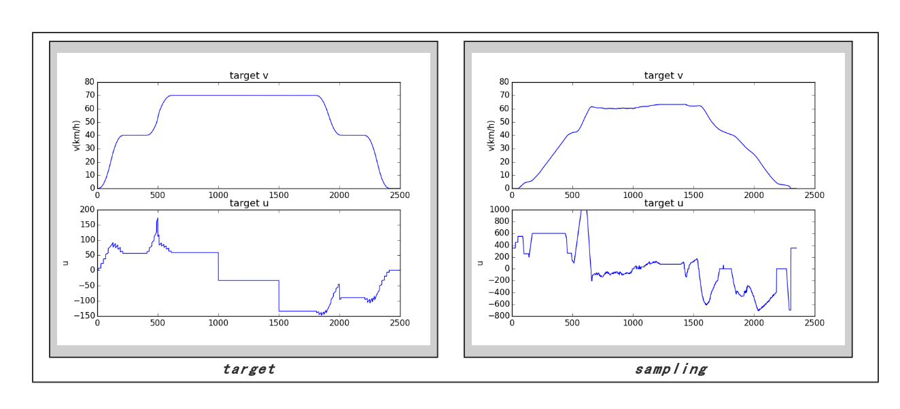
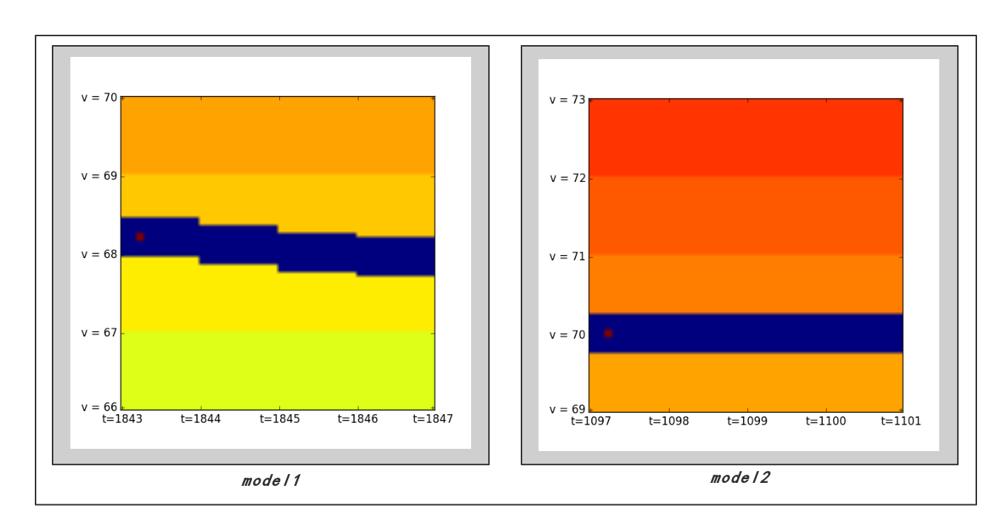

# DQN & ATO

本文档是整理一下两篇WCSE2018的论文代码和设计思路而来。两篇文章主要的工作在于将传统列车模型状态抽象为2D图像游戏，然后利用经典的DQN算法尝试对列车需求的速度曲线进行控制。


## 列车模型与游戏抽象

#### 列车模型介绍

列车模型的抽象来源与杭州地铁数据。数据以csv格式储存，包含连续上千个采样点上的列车速度与实时牵引力的大小，这里参考女友师姐的文章（）。

文章中介绍到我们可以通过传统的系统辨识的方法。我们直接将辨识出的列车模型抽象成函数*train_model* ,定义在*game/train_model.py*　中。可以看到这是个分段的二次函数，通过某一时刻的列车速度和当前推力以及时刻点返回下一时刻的列车速度。



**我们的目标是在这个模型假设的基础上完成对列车模型的控制算法的实现。**决定尝试dqn强化学习的解决方案，列车模型不再以参数化的形式出现在控制算法或者是生成控制算法的流程中。而是将列车模型抽象成一个模拟器（通过输入控制列车状态的转移）。


#### 游戏抽象

参考经典的dqn论文 [Human-level control through Deep Reinforcement Learning](https://storage.googleapis.com/deepmind-media/dqn/DQNNaturePaper.pdf) ,我们仿照电子游戏试图将列车某一采样点时刻的状态用图像表示出来，同时我们期望在这个转化的过程中保有以下的性质：

1. 图像能描述当前列车的运行状态信息（近似单射），不同的状态对应的图像不同。
2. 变换后保持有近似的等变性，相似的列车状态转换出来的图像是相似的。
3. 图像语音信息明确，在了解变换过程之后，人可以毫不费力的理解图像对应的列车状态。

我们可以把这个转换的过程，称为渲染（render）。当然一个游戏模拟器不仅仅包括渲染，还有输入输出控制，奖励机制等等。而输入输出控制与奖励机制是文章研究这种利用DQN实现控制的思想的对照实验重点。整个游戏的代码实现在 game/pic_game.py。


#### Render过程（state2picture）

首先先看几张渲染后的图片：



不需要多余的解释我们也能看懂，render出来的画面是一张时刻速度图像。

1. 图中蓝色的区域表示了途中显示的时刻上的目标速度与可以允许的误差范围（范围越大，蓝色带越宽）。
2. 蓝色带中黑点则表示了该时刻列车的速度。(处在的时刻点和速度)
3. 不同的速度，背景颜色（数值）也是不同的。

生成图像所需要的参数如下：

| width | height |  time_interval_per_pixel  | velocity_interval_per_pixel | crash_limit |
| :---: | :----: | :-----------------------: | :-------------------------: | :---------: |
| *80*  |  *80*  | *0.05 sample_point/pixel* |     *0.05 (km/h)/pixel*     | *0.3 km/h*  |

##### *分析*

##### 优点：　

​	简单明了，在一定的精度要求下，基本符合我们需求的性质（１～３）

##### 缺点：

1. 精度问题，例如v=70 与 v=70+0.5*velocity_interval_per_pixel渲染出来是完全相同
2. 表达能力，在图像大小确定的情况下与精度是矛盾的，例如精度越高，我们能展示的状态空间就越小。例如time_interval_per_pixel越大，图像在时间上所展现未来的速度需求就越少，不利于预测控制。例如velocity_interval_per_pixel越大，那么可以展示的速度范围就越小，好在列车加减速都较为平缓，所以我们的参数应该是一定trade-off后的结果。
3. 单张图片不能展示列车的二阶状态，例如列车正在加减速或者匀速等等dengdeng。好在DQN的输入是由某时刻点前４个时刻的图片叠加输入的。


#### 输入控制

在把列车状态转化为图像的过程中我们就已经感受到如何将连续状态空间合理的应用到qlearning的场景下是一个非常大的问题。即使是图像也是离散的状态空间。而更为迫切的就是输入控制问题。输入变量理论上是连续的，但在dqn里，输入变量是离散的。以下两点帮助我们解决这个问题：

1. 通过统计实际列车的操作数据，我们可以发现实际的delta_u是离散的整数值，不会出现无限精度的连续值。
2. 在整个实际的列车控制当中，delta_u基本出现在几个分布最多的值上，我们可以选为输入控制的状态空间。
3. ATO的模糊控制理论。

实际上我们选取一定的控制状态，例如５～７个，涵盖正常的需求即可。（某种程度上ＡＴＯ的好坏也包含了对delta_u的限制，例如最好不要急刹车。）在我们的游戏中，我们设计为：

```python
def Game():
	actions = [-10, -5, 0, 5, 10]
```

或者是：

```python 
def Game():
  	k_action = 5
	actions_num = 5 #[-10,-5,0,5,10]
```

当然对于输入控制的状态空间我们可以合理猜测，状态空间越大越精细，最终学习的控制效果将越好，而学习过程将越困难。


#### 奖励函数


